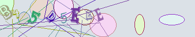

# iKaptcha

A CRNN that solves the Ikariam pirate fortress captcha.



| Model | Params | Original val | Corrected val |
|---|---|---|---|
| YOLOv8n (IkabotAPI baseline) | ~3 M | 78.7% | 81.2% |
| **CRNN (this repo)** | **1.66 M** | **95.0%** | **97.3%** |

Character accuracy: **99.5%**. Production model: `models/ikaptcha.onnx` (6.4 MB) — also available standalone as a release asset in [v1.0.0](https://github.com/Mahrkeenerh/iKaptcha/releases/tag/v1.0.0).

## Quick start

```bash
uv venv && uv pip install -e .
python scripts/predict_onnx.py data/samples/test1.png data/samples/test2.png
```

```
data/samples/test1.png: b45d5eee  (conf=0.993)
data/samples/test2.png: aqrckd3   (conf=0.995)
```

`scripts/predict_onnx.py` depends only on `onnxruntime`, `Pillow`, and `numpy` — no PyTorch needed at inference time.

## Python API

Minimal standalone inference — no `ikaptcha` package required:

```python
import numpy as np
import onnxruntime as ort
from PIL import Image

VOCAB = "-abcdefghjklmnpqrstuvwxy23457"  # index 0 is the CTC blank

# 1. Preprocess: 48x256 RGB, normalized to [-1, 1], NCHW float32
img = Image.open("data/samples/test1.png").convert("RGB").resize((256, 48), Image.BILINEAR)
x = (np.asarray(img, dtype=np.float32) / 255.0 - 0.5) / 0.5
x = x.transpose(2, 0, 1)[None, ...]  # (1, 3, 48, 256)

# 2. Inference
session = ort.InferenceSession("models/ikaptcha.onnx")
logits = session.run(None, {"input": x})[0]  # (64, 1, 29)

# 3. Greedy CTC decode: argmax, collapse repeats, drop blanks
ids = logits.argmax(axis=2)[:, 0]
out = "".join(VOCAB[i] for j, i in enumerate(ids)
              if i != 0 and (j == 0 or i != ids[j-1]))
print(out)  # "b45d5eee"
```

> Vocab note: 28 characters, not 36. The game server excludes `0 1 6 8 9 I O Z` as visually ambiguous.

## Model I/O

For porting to other runtimes (`onnxruntime-web`, `cv2.dnn`, mobile, C++):

- **Input**: `(1, 3, 48, 256)` float32 — RGB, normalized with mean=0.5, std=0.5 (i.e. `(pixel/255 - 0.5) / 0.5`, giving values in `[-1, 1]`)
- **Output**: `(64, 1, 29)` float32 logits — 64 timesteps × (28 characters + CTC blank at index 0)
- **Decode**: greedy CTC — argmax per timestep, collapse consecutive duplicates, drop blanks
- **Runtime compatibility**: verified on `onnxruntime`, `cv2.dnn` (≥ 4.8.0), and PyTorch — bit-identical predictions across all three

## Datasets

The training data is not in git — it's published as a [v1.0.0 release asset](https://github.com/Mahrkeenerh/iKaptcha/releases/tag/v1.0.0). To set up for training or reproducing the eval:

```bash
bash scripts/download_data.sh
```

This fetches and extracts two datasets into `data/`:

- `ikariam_pirate_captcha_dataset/` — original 1,200/300 YOLO train/val from IkabotAPI
- `dataset_pseudo_v2/` — production 11,210/298 train/corrected-val

Both datasets are available as `.tar.gz` (Linux/macOS) and `.zip` (Windows) in the release. Windows users without a POSIX shell can download the `.zip` files manually and extract them into `data/`.

## Credits

YOLOv8n baseline and the original 1,500-sample dataset are from [IkabotAPI](https://github.com/Ikabot-Collective/IkabotAPI). The upstream PR integrating this model back into IkabotAPI: [Ikabot-Collective/IkabotAPI#37](https://github.com/Ikabot-Collective/IkabotAPI/pull/37).

Full technical writeup, ablations, and "what didn't work" notes: see `FINDINGS.md`.
